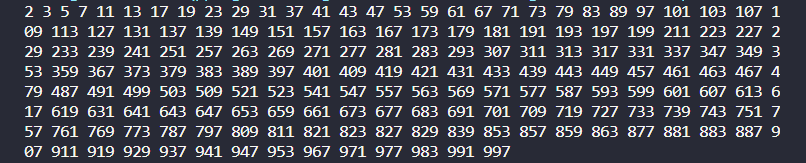

# Sàng số nguyên tố Eratosthenes

sàng số nguyên tố là một thuật toán được sử dụng để tìm tất cả các số nguyên tố nhỏ hơn hoặc bằng một số nguyên N nào đó. Thuật toán này được đặt theo tên của nhà toán học Hy Lạp Eratosthenes, người đã phát minh ra nó vào thế kỷ thứ 3 trước Công nguyên.

<h4>Nguyên lý hoạt động của sàng Eratosthenes như sau:</h4>

- Ban đầu, ta tạo một mảng các số nguyên từ 2 đến N.
- Duyệt từng số nguyên trong mảng, bắt đầu từ số 2.
- Nếu số nguyên hiện tại chưa bị đánh dấu, thì đó là một số nguyên tố.
- Đối với mỗi số nguyên tố đã tìm thấy, ta đánh dấu tất cả các bội của số nguyên tố đó trong mảng.
- Tiếp tục duyệt cho đến khi tất cả các số nguyên trong mảng đều đã được đánh dấu.

<h5>Ghi chú: </h5>

- Sàng số nguyên tố - chỉ dùng cho mảng có kích thức nhỏ hơn hoặc bằng 10^7 nếu lớn hơn sẽ bị tràng bộ nhớ STACK


Bước 1: khai báo một mảng bool có 10^7 + 1 phần tử 
Vậy nên trị số của mảng sẽ chạy từ 0 đến 10^7
Hoặc có thể chọn số phần tử cần sàng bằng cách sau:

```C++
const int MAXN = 10000001; 
bool nt[MAXN]; // 0-> 10000000
```

Bước 2: viết hàm sàng số nguyên tố
```C++
void Sang()
{
    for(int i = 0; i <= MAXN; i++)
    {
        nt[i] = true;
    }

    // Nếu không dùng for để set thì dùng hàm memset
    //menset(nt, true, sizeof(nt));

    // Loại thủ công
    nt[0] = nt[1] = false;

    // Duyệt từ 2 đến sqrt(MAX_N): 
    for(int i = 2; i <= sqrt(MAX_N); i++){
        if(nt[i]){
          /**
           * Trong vòng for này: ta duyệt từ i*i chứ không phải i*2, Vì
           * i*2 đã bị loại khi duyệt bội của số nguyên tố nhỏ hơn rồi
           * VD khi duyệt bội của số nguyên tố 2 ta sẽ loại từ 2*2, đến 4+2=6, đến 6+2=8,...
           * Khi duyệt đế bội số nguyên tố 3: số 6 đã bị loại trước đó rồi nên sẽ duyệt từ 3*3
          */          
          for(int j = i*i; j<= MAX_N; j+= i){ // Cần chú ý: tại sao j = i*i và j += i ???
            nt[j] = false;
          }
        }
    }

    
}
```

Tổng quát chương trình như sau:

```C++
#include <iostream>

using namespace std;

int main() {
  int n;
  cout << "Nhập số nguyên N: ";
  cin >> n;

  // Tạo mảng các số nguyên từ 2 đến N
  int *a = new int[n + 1];
  for (int i = 2; i <= n; i++) {
    a[i] = 1;
  }

  // Duyệt các số nguyên từ 2 đến N
  for (int i = 2; i * i <= n; i++) {
    // Nếu số nguyên hiện tại là số nguyên tố
    if (a[i] == 1) {
      // Đánh dấu tất cả các bội của số nguyên tố hiện tại
      for (int j = i * i; j <= n; j += i) {
        a[j] = 0;
      }
    }
  }

  // In ra các số nguyên tố
  for (int i = 2; i <= n; i++) {
    if (a[i] == 1) {
      cout << i << " ";
    }
  }
  
  delete[] a;

  return 0;
}
```

```c++
#include <iostream>
#include <math.h>
using namespace std;

//Sàng số nguyên tố - chỉ dùng cho mảng có kích thức nhỏ hơn hoặc bằng 10^7 nếu lớn hơn sẽ bị tràng bộ nhớ STACK
const int MAX_N = 10000001;
bool nt[MAX_N]; // i : 0 -> 10^7


void sang(){
// Set tất cả các phần tử của nt[] là true
    for(int i = 0; i < MAX_N; i++ ){
        nt[i] = true;
    }
    // Hoặc không dùng for() có thể dùng hàm memset()
    // memset(nt, true, sizeof(nt)); 

    // Loại thủ công
    nt[0] = nt[1] = false;

    // Duyệt từ 2 đến sqrt(MAX_N): 
    for(int i = 2; i <= sqrt(MAX_N); i++){
        if(nt[i]){
            for(int j = i*i; j<= MAX_N; j+= i){ // Cần chú ý: tại sao j = i*i và j += i ???
            // Nếu không biết câu trả lời thì đọc ở README
                nt[j] = false;
            }
        }
    }

    
}

int main()
{
    sang();
    for(int i = 0; i<= 1000; i++)
    {
        if(nt[i]) cout << i << ' ';
    } 
    return 0;
}
```

Kết quả của chương trình trên:

